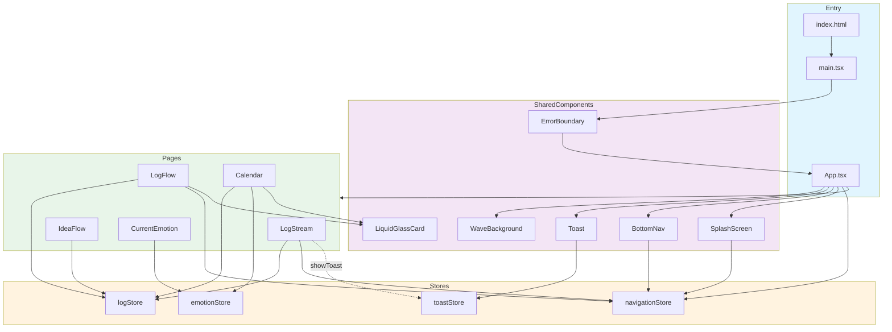

# Flash 一闪 — 仓库整体架构

> 技术栈：React 19 + TypeScript + Vite + Tailwind CSS + Framer Motion + Zustand + Capacitor

---

## 1. 入口在哪里，启动后做了什么

### 1.1 构建入口

```
index.html
  └── <script type="module" src="/src/main.tsx"></script>
```

Vite 以 `index.html` 为构建入口，dev 时启动在 `localhost:3000`。

### 1.2 运行时入口

`src/main.tsx`：

1. 查找 `div#root`；
2. 使用 `react-dom/client` 的 `createRoot` 创建根；
3. 用 `StrictMode` 包裹；
4. 挂载全局 `<ErrorBoundary>`；
5. 渲染 `<App />`。

### 1.3 App 启动流程

`src/App.tsx` 负责整体布局与路由：

```
main.tsx
  └── App
        ├── WaveBackground      (Canvas 动态波浪背景)
        ├── 当前 Page 内容        (根据 currentPage 切换)
        ├── BottomNav           (只在 tab 页显示)
        ├── Toast               (全局提示)
        └── SplashScreen        (启动屏，3s 后自动关闭)
```

启动后 App 立即显示 3 秒 `SplashScreen`，同时由 `WaveBackground` 绘制动态背景。首屏页面默认是 `LogStream`（`currentPage = 'log'`）。

### 1.4 页面切换机制

- 状态保存在 `navigationStore` 中；
- `currentPage` 决定当前渲染哪个页面；
- `BottomNav` 切换 `activeTab`（log / idea / calendar / emotion）；
- `LogStream` 中的搜索按钮可跳转到 `LogFlow`（非 tab 页面，此时隐藏底部导航）。

---

## 2. 主要模块之间的依赖关系

### 2.1 目录分层

```
src/
├── main.tsx              # React 挂载入口
├── App.tsx               # 根组件：布局 + 路由 + 全局动效
├── index.css             # 全局样式 / Tailwind / 玻璃拟态工具类
├── lib/
│   └── utils.ts          # cn() 工具函数（clsx + tailwind-merge）
├── hooks/
│   └── useClickOutside.ts# 点击外部关闭 hook
├── components/           # 共享 UI 组件
│   ├── BottomNav.tsx     # 底部 tab 导航
│   ├── SplashScreen.tsx  # 启动屏
│   ├── Toast.tsx         # 全局 toast
│   ├── WaveBackground.tsx# 动态波浪背景
│   ├── LiquidGlassCard.tsx# 玻璃卡片
│   └── ErrorBoundary.tsx # 错误边界
├── pages/                # 页面级组件
│   ├── LogStream/        # 日志流首页（输入 + 列表 + 详情/编辑弹窗）
│   ├── LogFlow.tsx       # 搜索/筛选/管理页
│   ├── IdeaFlow/         # 想法池
│   ├── Calendar.tsx      # 日历视图
│   └── CurrentEmotion/   # 情绪记录
└── stores/               # 全局状态
    ├── navigationStore.ts
    ├── logStore.ts
    ├── emotionStore.ts
    └── toastStore.ts
```

### 2.2 依赖关系



### 2.3 状态消费矩阵

| 页面/组件      | navigationStore | logStore | emotionStore | toastStore |
| -------------- | --------------- | -------- | ------------ | ---------- |
| App            | ✅              |          |              |            |
| BottomNav      | ✅              |          |              |            |
| SplashScreen   | ✅              |          |              |            |
| LogStream      | ✅              | ✅       |              |            |
| LogFlow        | ✅              | ✅       |              |            |
| IdeaFlow       |                 | ✅       |              |            |
| Calendar       |                 | ✅       | ✅           |            |
| CurrentEmotion |                 |          | ✅           |            |
| Toast          |                 |          |              | ✅         |

---

## 3. 配置和数据的加载流程

### 3.1 配置加载顺序

```
1. Vite 读取 vite.config.ts
   ├── 端口 3000
   ├── base: './'
   ├── React 插件
   └── 路径别名 @/ -> ./src

2. 浏览器加载 index.html

3. Vite 处理 src/main.tsx
   ├── tsconfig.app.json / tsconfig.json 类型配置
   ├── Tailwind + PostCSS 处理 index.css
   └── 组件热刷新

4. 生产构建时
   └── vite build 输出到 dist/
       └── Capacitor 将 dist/ 打包为 Android APK（capacitor.config.ts 中 webDir: 'dist'）
```

### 3.2 数据加载与持久化

所有业务数据都走 **Zustand Store**，没有后端 API。

```
App 启动
  ├── Zustand 初始化 store
  │     ├── 若 localStorage 中存在持久化 key，则反序列化加载
  │     └── 否则使用 store 内嵌的 DEMO 数据作为初始值
  └── 页面渲染时直接读取 store 状态
```

#### 持久化 key

| Store           | localStorage key   | 持久化字段                 |
| --------------- | ------------------ | -------------------------- |
| navigationStore | `flash-navigation` | `currentPage`、`activeTab` |
| logStore        | `flash-logs`       | `logs`                     |
| emotionStore    | `flash-emotions`   | `emotions`                 |
| toastStore      | 无                 | 仅内存                     |

#### 数据流转示例（记录一条日志）

```
用户输入 → LogStream.InputArea
            → handleSubmit → CategorySheet 选择分类
              → logStore.addLog(content, tag, category)
                → 生成 UUID、createdAt、recordDate
                → 写入 Zustand state
                → zustand/persist 自动同步到 localStorage
                  → 所有订阅了 logStore 的组件自动重渲染
```

#### 数据共享示例（Calendar）

`Calendar` 同时消费 `logStore.logs` 和 `emotionStore.emotions`，按 `recordDate` 聚合，生成日历上的标签色点和情绪色条。

---

## 4. 模块关系图（简化版）

```
┌─────────────────────────────────────────────────────────────┐
│                         启动层                               │
│  index.html  →  main.tsx  →  ErrorBoundary  →  App.tsx       │
└─────────────────────────────────────────────────────────────┘
                              │
        ┌─────────────────────┼─────────────────────┐
        ▼                     ▼                     ▼
┌───────────────┐    ┌─────────────────┐    ┌──────────────┐
│   全局状态层   │    │    共享 UI 层    │    │   页面层      │
│ navigationStore│    │ BottomNav       │    │ LogStream    │
│ logStore       │◄──►│ SplashScreen    │    │ LogFlow      │
│ emotionStore   │    │ Toast           │    │ IdeaFlow     │
│ toastStore     │    │ WaveBackground  │    │ Calendar     │
└───────────────┘    │ LiquidGlassCard │    │ CurrentEmotion│
                     └─────────────────┘    └──────────────┘
                              │                     │
                              └─────────────────────┘
                                           │
                                           ▼
                              ┌─────────────────────┐
                              │   工具/样式层        │
                              │ lib/utils.ts        │
                              │ hooks/useClickOutside│
                              │ index.css (Tailwind)│
                              └─────────────────────┘
```

---

## 5. 关键设计特点

1. **单页无路由库**：用 `navigationStore.currentPage` 做简单页面切换，适合移动端壳应用。
2. **数据全本地**：使用 Zustand `persist` 中间件落到 `localStorage`，无需后端。
3. **Log 与 Idea 统一模型**：`LogItem.category` 区分 `log`/`idea`，IdeaFlow 只是对同一数据集的不同视图。
4. **懒加载页面**：App 中 `lazy(() => import(...))` 所有页面，减少首屏 JS。
5. **Capacitor 打包**：`dist/` 作为 Web 资源，可构建 Android APK。
