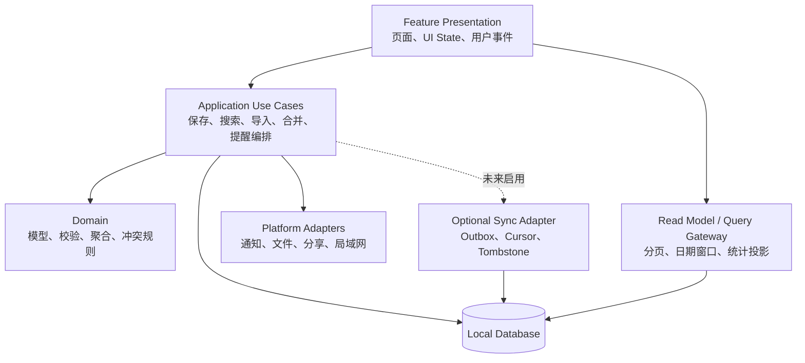

# Flash 三端重构路线与缺口修补方案

> 评估对象：Android、macOS、HarmonyOS 原生客户端  
> 基线版本：Flash Aero v0.1.0 当前工作区  
> 评估日期：2026-09-04  
> 状态：架构评估 + 已确认漏洞修补实施记录

## 1. 执行摘要

Flash 当前最适合继续采用“本地优先、无中心后端”的产品架构。三端已经具备可用的数据存储、备份互通和平台原生体验，没有必要为了形式统一而引入云服务、KMP 共享 UI 或重量级多模块工程。

当前主要问题不是技术栈选择，而是三端内部边界不一致：

- Android 已形成 `Compose → ViewModel/StateFlow → Repository → Room` 主路径，但依赖获取仍偏服务定位器模式，数据查询以全表观察为主。
- macOS 有意采用 `@Query` 直读、Repository 统一写入，适合小型本地应用；部分聚合仍在视图重绘路径内，备份与传输编排集中在大型设置视图中。
- HarmonyOS 的持久层已升级到 RDB，但页面、业务编排、瞬时状态和跨端传输集中在单个 `Index.ets`，并依赖写入后的全局 `refresh()`。
- 三端共同遵守 `flash-backup-v2`，但协议模型、校验器、合并规则和测试样例分别实现，存在随功能增加而漂移的风险。

推荐路线：

1. 先修复数据一致性、迁移可验证性和测试空白等 P0/P1 缺口。
2. 以 HarmonyOS 单页拆分为第一项结构性重构。
3. 优化三端查询边界与派生数据计算，保持本地数据库为唯一事实来源。
4. 建立跨端协议契约与黄金样例，不急于共享运行时代码。
5. 只有在多设备自动同步需求得到验证后，才接入独立的 `flash-sync-v1` 层。

### 1.1 2026-09-05 修补状态

本轮已完成可从代码确认、且不需要改变产品威胁模型的安全与可靠性修补：

- Android 备份快照改为单一 Room 事务；启用 schema 导出，新增 v4 查询索引迁移，并增加 v1→v4、v2→v4、v3→v4 迁移验证代码；
- 三端导出/局域网发送统一从单次仓储快照生成，macOS 不再在仓储缺失时静默导出空数据；
- Android 与 HarmonyOS 接收器支持主动取消；Android/macOS 快速重启局域网会话时以会话代次隔离旧回调；三端发送端均限制并发连接并在单连接超时后释放资源；
- HarmonyOS 初始化失败后可重试；Preferences 迁移中的异常旧数据先隔离保存到应用沙箱文件（不再写入 Preferences，避免单值 8 KB 上限导致启动永久失败），再删除旧键，并提供用户可见的原始恢复文件导出；
- 三端提醒重建均传播真实错误。Android/macOS/HarmonyOS 先发布或替换完整的新提醒集合，再清理旧集合，避免“先清空、后部分失败”；HarmonyOS 仅清理任务提醒组；
- Android/macOS 会在后续启动清理过期的明文分享副本；三端 UI 均明确提示备份为敏感明文，局域网协议仅适用于可信家庭或办公网络。
- macOS 所有仓储写操作在保存失败时回滚；覆盖导入和清空改为可回滚的逐实体删除，避免失败操作残留到后续无关保存。文件导出改为同目录临时文件加原子替换，替换失败时保留旧备份并清理明文临时文件；
- HarmonyOS 对当前加密 RDB 中无法解析或未通过协议校验的 payload 先把表名、记录 ID、原始内容和原因隔离到沙箱 `quarantine/` 文件，再从正常视图隐藏；隔离写入失败只降级为告警，绝不阻塞初始化；恢复文件同时包含旧版迁移与 RDB 隔离数据；旧版本写入 Preferences 的隔离键在首次启动时一次性搬移到文件并删除。

验证结果：Android `testDebugUnitTest` 与 AndroidTest Kotlin 编译通过；macOS 保存失败回滚与原子导出故障注入测试通过；HarmonyOS debug HAP 构建通过。当前机器没有 `adb`，因此 Android v1/v2/v3 迁移 instrumentation 测试已编译但尚未在设备或模拟器执行。HarmonyOS 的 RDB 隔离路径（超大 payload 落沙箱文件、隔离写入失败不阻塞启动、旧 Preferences 隔离键搬移）与全天任务非法日期拒绝已有主机回归测试，设备级故障注入测试仍待补充。

漏洞修补阶段未实施的重构/质量建设项目包括：HarmonyOS 自动化测试基建、`Index.ets` 模块拆分、查询分页/FTS、跨端黄金 fixture，以及局域网端到端加密协议升级；其后续完成情况见 §1.2。明文 LAN 在现有文档明确的“可信局域网”威胁模型下保留；若产品要支持公共或不可信 Wi-Fi，必须先升级为带身份确认的加密握手。

### 1.2 HarmonyOS P0 结构重构实施状态

已完成 `ARCH-01` 的页面与控制器拆分，以及 §6.3 第二阶段的分区状态更新：

- `Index.ets` 从 1,802 行收敛到当前 398 行，保留装配、导航、响应式布局与转场；9 个功能页面、5 个弹窗/覆盖层及公共展示构件已独立。
- `AppController` 负责初始化、订阅与生命周期；`LogsController`、`EmotionController`、`CalendarController`、`BackupController` 分别负责自己的功能操作，页面不再直接调用 Store、文件、备份编解码、Socket 或系统提醒 API。
- `FeatureStates` 按导航、主题、首页、日志、情绪、日历、备份、设置和反馈分区；`FeatureProjection` 只更新发生变化的业务分区，已移除页面写后全局 `refresh()`。跨日只刷新当日计数；单条写入保留其他分区数组、索引、分页和编辑草稿。
- 原全局 `operationBusy` 改为功能级忙碌状态；文件导出不会阻塞日志/情绪保存。导入与 LAN 采用显式阶段枚举，Store 写操作串行执行，失败不发布成功通知，也不阻塞后续写入。
- 页面退出解除订阅、停止定时器与 LAN 会话；过期初始化、文件选择、设备发现和发送/接收回调无法重新覆盖当前会话状态。
- 新增 `harmonyos/tests/` 主机回归测试，覆盖分区隔离、并发写入、失败事务、草稿保留、重复提交、导入重试和生命周期。测试使用实际 `.ets` 源码及显式平台替身。

验证：10 项主机逻辑测试和 debug HAP 构建通过。`hdc list targets` 无连接设备，因此 ArkUI 运行时、页面视觉/交互和原生 RDB 故障注入尚未进行设备验收。

本轮没有更改 RDB schema。`PERF-04` 中的查询列正规化、索引、日期窗口查询仍待独立迁移实施；`TEST-01` 已有主机测试起点，但完整协议/日期/原生迁移覆盖与设备级验收仍未完成。跨端 fixture 与 CI 已接入，当前完成状态以 §1.1、§1.2 和 §1.3 为准。

### 1.3 跨端协议首版契约（2026-09-05）

`CONTRACT-01` 已有首版设计与校验起点：新增 [v2 JSON Schema](contracts/flash-backup-v2.schema.json)、[技术契约](contracts/README.md)、[经理版说明](flash-backup-protocol-for-managers.md)、有效/旧版样例，以及开发用参考校验器；严格标准入口和独立恢复入口已接入三端。本次沿用 `flash-backup-v2` 和三个分区 schema 1，没有引入同步服务。

验证：26 项参考契约测试、4 项 HarmonyOS 实际编解码主机测试与 10 项既有结构测试，共 40 项通过。已明确记录日志重要性越界、Unicode 长度、数组上限、未知字段和时间规范化等实现差异。

尚未完成：三端原生实现完全对齐和设备互传验收；共用正反黄金文件、合并冲突结果以及 Android/macOS 样例接入已纳入 CI，远端 CI 门禁已确认。`CONTRACT-01` 仍不能标记为全部完成；完整状态与本轮取舍见技术契约 §7。

## 2. 评估范围和术语

本文评估以下六个方面：

- 前端与数据/服务边界；
- 功能模块拆分；
- 页面和应用状态管理；
- 数据层与缓存策略；
- 功能与同步扩展能力；
- 启动、查询、搜索、聚合和批量导入性能。

本文所称“缺口”包括已能从代码确认的问题和高概率工程风险；“漏洞修补”同时覆盖正确性、数据安全、可靠性和性能退化，不等同于正式安全审计。尚未通过复现或专项扫描证实的问题不会标记为已存在的安全漏洞。

## 3. 当前架构基线

### 3.1 产品边界

Flash 当前没有账号和中心后端。用户内容保存在本机数据库中，跨设备能力由以下适配器提供：

- 版本化 JSON 快照导入/导出；
- 系统分享；
- 可信局域网内的临时 PIN 配对传输；
- 本地通知和提醒调度。

因此当前的“后端边界”实际位于客户端内部：UI 不应直接承担数据库、备份文件、局域网连接或提醒重建职责；这些能力应通过应用用例与适配器暴露。

### 3.2 三端现状

```mermaid
flowchart LR
    subgraph Android
        AUI[Compose Screen] --> AVM[ViewModel / StateFlow]
        AVM --> AR[FlashRepository]
        AR --> Room[(Room)]
        AUI -. 获取依赖 .-> AA[FlashApplication]
    end

    subgraph macOS
        MUI[SwiftUI View] -->|@Query 读| SD[(SwiftData)]
        MUI -->|Repository 写| MR[FlashRepository]
        MR --> SD
    end

    subgraph HarmonyOS
        HI[Index.ets\n页面 + 状态 + 编排] --> HS[FlashStore\n内存数组]
        HS --> HR[(RDB JSON payload)]
        HI -->|写后 refresh| HS
    end
```

| 平台 | 当前优势 | 主要限制 | 重构优先级 |
| --- | --- | --- | --- |
| Android | MVVM/StateFlow 清晰；Room 事务；领域纯函数可测试 | 全表 Flow；实体缺少查询索引；Screen 直接获取 Application；SettingsViewModel 职责偏多 | P1 |
| macOS | 原生 `@Query` 简洁；统一写仓储；装配入口单一；持久化失败有告警 | 部分全量查询和聚合发生在视图层；备份/传输编排集中；读模型仅部分页面建立 | P1 |
| HarmonyOS | 已有加密 RDB；批量写入有事务；三端备份协议一致 | 1,700+ 行单页；大量全局 `@State`；手动全量刷新；业务列封装在 JSON 中；无自动化测试目录 | P0 |

## 4. 目标架构

推荐三端对齐边界，而不是强制对齐框架或文件数量。



### 4.1 依赖规则

1. UI 只能依赖 UI State、用例和只读查询接口。
2. 领域模型和纯函数不得依赖 Compose、SwiftUI、ArkUI、Room、SwiftData 或 RDB。
3. 数据库是用户内容的唯一事实来源；页面内存只保存草稿、筛选、选择、导航和一次性事件。
4. 文件、通知、局域网与未来同步均是基础设施适配器，不进入领域模型。
5. 备份快照和自动同步使用不同传输语义；不得把覆盖式备份接口直接改造成同步接口。

### 4.2 推荐功能边界

三端均按以下功能组织，内部结构允许遵循平台习惯：

- `logs`：日志、灵感、详情、搜索与 Idea 阅读状态；
- `emotions`：情绪记录、子情绪与趋势；
- `tasks-calendar`：任务、月历聚合与提醒；
- `insights`：首页投影、统计和跨内容搜索；
- `backup-transfer`：协议编解码、差异预览、导入导出、局域网传输；
- `settings`：主题、欢迎状态和不含业务编排的设置 UI；
- `shared-domain`：日期窗口、校验规则、协议常量和测试 fixture。

当前代码量不要求 Android 立即拆成多个 Gradle module，也不要求三端共享运行时代码。先让目录和接口反映边界，等编译隔离、团队并行或复用收益明确后再物理拆包。

## 5. 已确认缺口与修补方案

### 5.1 P0/P1 缺口矩阵

| ID | 等级 | 平台 | 已确认现象 | 影响 | 修补方案 | 验收方式 |
| --- | --- | --- | --- | --- | --- | --- |
| DATA-01 | P0 | Android | `exportSnapshot()` 依次读取三个 DAO，未在同一事务中形成快照 | 导出期间若有并发写入，日志、情绪和任务可能来自不同时间点 | 为 DAO 增加同步 `getAll()`，在 `db.withTransaction` 中一次读取并转换 | 并发写入导出测试；快照内引用和计数保持一致 |
| DATA-02 | P0 | Android | Room `exportSchema = false`，迁移仅靠手写 SQL 和现有单测间接覆盖 | 模型演进时难以审查 schema 差异，迁移回归可能导致启动失败或数据损坏 | 启用 schema 导出；提交 schema JSON；使用 `MigrationTestHelper` 覆盖 v1→当前版本 | CI 从每个历史 schema 迁移并校验记录 |
| TEST-01 | P0 | HarmonyOS | 未发现自动化测试目录；备份、日期、合并、Store 迁移主要依赖人工验证 | 三端协议和大规模重构缺少安全网 | 先为 `BackupService`、`BackupDiff`、日期/时区、FlashStore 合并与迁移补纯逻辑测试 | 协议 fixture 在 HarmonyOS 测试中全部通过 |
| ARCH-01 | P0 | HarmonyOS | `Index.ets` 同时持有导航、主题、编辑、传输、导入、搜索、日历和渲染状态 | 改一处易影响全页；难以测试和并行开发；状态更新扩大重绘范围 | 拆成 Feature Page、Controller/Store、独立 Dialog/Sheet 和应用导航壳 | `Index` 仅保留装配/导航；业务逻辑可脱离 UI 测试 |
| PERF-01 | P1 | Android | 日志、情绪、任务均使用 `observeAll()`；筛选、搜索和聚合在内存处理 | 任意写入可能重新加载和映射全表；数据增长后搜索与重组成本线性增加 | 增加日期窗口、分类、ID、分页与统计投影查询；搜索达到阈值后接入 Room FTS | 1k/10k 数据集下关键页面查询与输入延迟基准 |
| PERF-02 | P1 | Android | Room 实体除主键外未声明索引 | 排序、分类、日期和未读 Idea 查询会随数据量退化 | 增加 `logs(category, createdAt)`、`logs(recordDate)`、`emotions(recordDate)`、`tasks(updatedAt)` 等索引，并补迁移 | `EXPLAIN QUERY PLAN` 命中索引；迁移测试通过 |
| PERF-03 | P1 | macOS | Calendar 在 `body` 中把三个完整实体数组映射为模型并聚合 | 非数据状态变化也可能触发重复 O(N) 计算 | 建立 CalendarReadModel，仅在实体输入变化时重算；或按可见月份使用 predicate 查询 | 切月、编辑弹窗和动画不触发无关全量重算 |
| PERF-04 | P1 | HarmonyOS | Store 启动读取所有 JSON payload；页面写操作后多处调用全量 `refresh()` | 启动内存、解析和交互成本随数据量线性上升 | 将常用查询字段正规化为列；Store 暴露分片状态/订阅；页面只刷新受影响 feature | 单条更新不复制全部三类数组；月历按窗口查询 |
| CONTRACT-01 | P1 | 全端 | 协议模型、校验器和合并规则在 Kotlin、Swift、ArkTS 中分别维护 | 合法性规则或默认值可能跨端漂移，造成数据丢弃或冲突结果不同 | 建立规范 JSON Schema、黄金 fixture、非法样例和跨端 round-trip CI | 每端对同一 fixture 得到相同接受/拒绝和合并结果 |
| ARCH-02 | P1 | Android | Screen 通过 `LocalContext` 转换为 `FlashApplication` 获取依赖 | 预览、测试和替换实现困难，UI 了解应用装配细节 | 定义 `AppContainer` 接口，经 CompositionLocal 或轻量 DI 注入 Repository、Settings、Reminder | Screen 测试可注入 fake，无需真实 Application/Room |
| ARCH-03 | P1 | Android/macOS | 设置层同时承担备份编解码、文件 IO、传输生命周期、差异分析和提醒重建 | 状态类/视图体积持续增长，错误恢复路径分散 | 提取 `ExportBackup`、`PrepareImport`、`ApplyImport`、`TransferBackup` 用例和 TransferCoordinator | Settings 只绑定 UI State；用例有独立失败/取消测试 |
| REL-01 | P1 | 全端 | 多处对提醒重建或启动读取使用 `try?`/空 catch | 用户无法区分“无提醒”和“提醒调度失败”，问题难以定位 | 建立结构化错误状态、一次性用户提示和本地诊断日志；禁止静默吞掉关键持久化/提醒错误 | 注入失败时 UI 可见且不崩溃，日志包含操作与错误类别 |

### 5.2 数据一致性修补

#### 原子快照

导出、差异分析和导入确认必须以同一个逻辑快照为输入。推荐每端提供统一接口：

```text
snapshot() -> FlashSnapshot(logs, emotions, tasks)
replace(snapshot)
merge(snapshot, policy)
```

- Android：`snapshot()` 在 Room 只读事务中完成。
- macOS：由 Repository 提供单一 `snapshot()`，避免 Settings 多次调用 `allLogs/allEmotions/allTasks`；保持在同一 ModelContext 隔离范围内。
- HarmonyOS：RDB 事务中读取三个分区，页面不得直接从三个可能不同步的内存数组拼接备份。

#### 迁移与恢复

- 每次 schema 修改必须同时提交迁移、历史 schema、迁移测试和回滚/恢复说明。
- 迁移失败不得静默创建空库覆盖旧数据。
- macOS 的内存降级保留现有用户告警，但应增加导出诊断和重试入口。
- HarmonyOS 对异常 payload 不只统计并跳过；建议写入 quarantine 表或生成可导出的恢复报告，防止用户无法找回原始内容。

### 5.3 安全与隐私缺口

#### 明文备份

当前 JSON 备份为便于跨端互通的明文格式，这是已记录的产品取舍，不应直接定义为漏洞。但需要降低误用风险：

- 导出确认页明确说明文件包含日志、情绪和任务全文；
- 分享缓存使用最小存活时间和受限 URI，传输结束后可清理；
- 文档和 UI 均提示只保存到可信位置；
- 若后续加入加密备份，应使用新的 envelope 字段和标准 AEAD，不在现有 JSON 字段上做自定义可逆混淆。

#### 局域网 PIN 传输

当前四位 PIN、60 秒有效期和最多五次尝试适用于“可信家庭/办公网络”的威胁模型。如果产品允许公共网络使用，应升级为：

1. 临时密钥协商；
2. PIN 只用于认证握手，不直接作为加密密钥；
3. 备份负载使用 AEAD 加密并绑定会话 transcript；
4. 双端展示设备名和短认证码；
5. 成功、超时或失败上限后销毁会话密钥并停止监听。

在完成上述升级前，应保持“可信局域网”限制，不将服务暴露为长期后台监听。

#### 本地静态数据

- HarmonyOS RDB 已启用加密。
- Android 已关闭系统云备份，但 Room 数据依赖系统设备加密。
- macOS 数据依赖 FileVault 和 App Sandbox。

短期建议维持平台原生磁盘保护，并把安全说明统一；只有用户研究证明需要应用级口令保护时，再评估密钥托管、遗忘恢复和多端同步的完整方案。

## 6. 三端具体重构路线

### 6.1 Android

#### 保留

- 单 Activity + Compose Navigation；
- ViewModel + StateFlow；
- Room 作为唯一事实来源；
- Repository 统一写入；
- Domain 纯函数；
- WorkManager/通知作为平台适配器。

#### 调整顺序

1. 修复原子快照和 Room schema 迁移测试。
2. 定义只读查询接口：`observeHomeSummary`、`observeLogsPage`、`observeCalendarWindow`、`observeStatsWindow`。
3. 增加索引和分页；输入搜索增加 debounce，数据量达到阈值后使用 FTS。
4. 建立 AppContainer，移除各 Screen 对 `FlashApplication` 的直接转换。
5. 从 SettingsViewModel 提取备份和传输用例。
6. 当功能或团队规模确实需要时，再考虑拆 `core-domain`、`core-data` 和 feature Gradle modules。

#### 不建议

- 立即引入 KMP 重写现有 Kotlin/Swift/ArkTS 领域模型；
- 为每个简单 CRUD 创建多层空壳接口；
- 用全局单例 StateFlow 代替 Room 观察流。

### 6.2 macOS

#### 保留

- SwiftUI + SwiftData；
- `@Query` 用于简单、局部、可限定范围的读路径；
- Repository 统一写路径；
- `RepositoryEnvironment.makeDefault()` 单一装配入口；
- AppState 只管理导航和命令路由。

#### 调整顺序

1. Repository 增加 `snapshot()`，收敛 Settings 中重复的三次全量读取。
2. 将 Calendar、Stats、Global Search 的派生数据搬入稳定 Read Model，只在输入变化时重算。
3. 为查询加 predicate、fetchLimit 和日期窗口，避免所有页面默认加载全部实体。
4. 把 SettingsView 的传输、导入预览和取消逻辑提取到 `BackupTransferModel`/用例。
5. 补充大数据 fixture 与主线程耗时测量；耗时解析和文件 IO 不占用 MainActor。

#### 不建议

- 为了与 Android 外观一致而强制所有读操作经过 Repository；
- 放弃 SwiftData `@Query` 的原生增量更新能力；
- 把所有页面状态提升到 AppState。

### 6.3 HarmonyOS

#### 第一阶段：拆页面，不改行为

把 `Index.ets` 收敛为应用壳和导航，先按现有功能拆出：

```text
pages/
  Index.ets
  HomePage.ets
  ExplorePage.ets
  EmotionPage.ets
  CalendarPage.ets
  SettingsPage.ets
features/
  logs/
  emotions/
  tasks/
  backup/
state/
  AppController.ets
  HomeState.ets
  CalendarState.ets
```

拆分期间保留现有 FlashStore API，避免同时修改 UI、状态和数据库造成大爆炸重构。

#### 第二阶段：状态分片

- 将全局 `@State` 分成导航、主题、Home、Explore、Calendar、BackupTransfer 等状态对象。
- 单个写操作只发布受影响分区的版本/快照。
- toast、确认框、传输进度使用一次性事件或明确状态机，不以空字符串编码状态。
- 将 `operationBusy` 拆成按操作作用域的状态，避免一个后台导出锁住所有保存操作。

#### 第三阶段：正规化 RDB

建议逐步从以下表结构演进：

```text
id | sort_key | payload
```

到包含可查询列的结构：

```text
logs:     id, category, record_date, created_at, importance, payload
emotions: id, level, record_date, created_at, payload
tasks:    id, due_kind, due_date, due_at, updated_at, completed_at, payload
```

`payload` 可暂时保留，保证协议对象完整性；查询、排序和聚合使用正规列。迁移完成并验证后，再决定是否完全列化业务字段。

#### 第四阶段：测试与性能基线

- BackupService 和 BackupDiff 纯逻辑测试；
- RDB 迁移、事务回滚和异常 payload 隔离测试；
- 日期、时区、全天任务和夏令时边界测试；
- 1k/10k 记录启动、搜索、切月、单条更新、导入测试。

## 7. 跨端契约治理

建议在 `docs/contracts/` 建立与实现语言无关的协议资产：

```text
docs/contracts/
  flash-backup-v2.schema.json
  fixtures/
    valid-minimal.json
    valid-full.json
    legacy-v1.json
    invalid-date.json
    invalid-enum.json
    duplicate-id.json
    merge-conflict.json
```

CI 中每端必须证明：

1. 对同一合法 fixture 全部接受；
2. 对同一非法 fixture 以相同原因拒绝或跳过；
3. 导出后再导入不改变语义；
4. 合并冲突结果一致；
5. 未知 schema 不会在 round-trip 时被静默丢弃；
6. 系统通知 ID、设备 ID、阅读状态和同步 cursor 不进入 portable backup。

不要求三个导出文件逐字节一致，因为 JSON 字段顺序可不同；要求解析后的标准化对象一致。

## 8. 性能治理方案

### 8.1 数据规模基线

建立四档可重复 fixture：

| 档位 | 日志/灵感 | 情绪 | 任务 | 用途 |
| --- | ---: | ---: | ---: | --- |
| S | 100 | 30 | 20 | 日常单测与预览 |
| M | 1,000 | 365 | 200 | 普通长期用户 |
| L | 10,000 | 3,000 | 2,000 | 压力与回归测试 |
| Import | 接近 50 MB 上限 | 混合合法/非法数据 | 冲突任务 | 导入、防护和内存峰值测试 |

### 8.2 关键指标

在固定设备、Release 构建、冷热缓存分别记录：

- 冷启动至可交互时间；
- 首页首屏查询和派生数据耗时；
- 搜索输入至结果展示的 P50/P95；
- 日历切月耗时和主线程长帧；
- 单条保存后的数据库写入与受影响 UI 更新范围；
- 备份导出、解析、差异计算、合并和覆盖耗时；
- 峰值 RSS/堆内存与导入结束后的回落情况。

第一轮不宜凭空制定绝对毫秒目标。先记录当前基线，再要求每次结构性改动：

- S/M 数据集无可感知回归；
- L 数据集不存在随一次按键触发的三表全量解析；
- 单条修改只更新相关 feature；
- 关键路径 P95 不比基线退化 10% 以上，若退化必须有产品收益说明。

## 9. 分阶段实施计划

### Phase 0：冻结契约与建立基线（3–5 天）

- 记录三端构建、测试和性能基线；
- 增加跨端协议 fixture 目录；
- 明确本轮不修改备份语义和 UI 行为；
- 为脏工作区中的在建 Calendar/Task 代码建立合并边界。

退出条件：三端能用相同 fixture 验证当前行为，重构前性能与功能有可比较基线。

### Phase 1：P0 数据与测试修补（1 周）

- Android 原子快照、schema 导出和迁移测试；
- HarmonyOS Backup/Store/日期测试；
- 三端关键错误不再静默吞掉；
- 补充导入失败与恢复路径。

退出条件：迁移、备份、合并和提醒重建均有自动化失败用例。

### Phase 2：HarmonyOS 结构拆分（1–2 周）

- 先拆页面和 Controller，保持 Store 行为不变；
- 再拆状态分区，移除写后全局 refresh；
- 最后正规化查询列和增加索引。

退出条件：Index 仅负责装配/导航；单条更新不重建全局数据；核心逻辑可脱离 UI 测试。

### Phase 3：Android/macOS 查询优化（1–2 周）

- Android 查询接口、索引、分页/窗口与 DI 边界；
- macOS Calendar/Stats/Search Read Model 与快照接口；
- 两端拆出备份/传输用例。

退出条件：常用页面不依赖无界全表扫描；设置 UI 不再拥有传输协议细节。

### Phase 4：跨端契约 CI 与发布门禁（3–5 天）

- 三端运行相同 fixture；
- 发布构建验证迁移、备份 round-trip 和性能烟测；
- 更新 README/ROADMAP，移除已过期的 Web/Capacitor 表述。

退出条件：协议变更若未同步更新 schema、fixture 和三端实现，CI 必须失败。

### Phase 5：同步就绪，仅在需求验证后启动

- 本地 side table 保存 revision、content hash、changedAt、删除状态；
- 本地事务同时写业务数据和 outbox；
- 支持幂等 operation、opaque cursor、tombstone 和冲突保留；
- 先拉后推，成功后推进 cursor；失败不改变 cursor；
- 服务端边界只承担认证、操作存储、游标和幂等，不承载 UI 业务规则。

## 10. 提交与回滚策略

为降低三端同时重构的风险，每个提交只做一种变化：

1. Characterization tests：锁定当前行为；
2. Move-only：移动文件和改 import，不改逻辑；
3. Extract：提取接口/用例，旧调用继续工作；
4. Switch：切换一个 feature 到新路径；
5. Delete：确认无调用后删除旧路径；
6. Optimize：最后加入索引、分页和查询重写。

数据库迁移不得与大规模 UI 拆分放在同一提交。涉及 portable backup 的变更必须同时更新协议文档、fixture、三端解析器和兼容测试。

回滚原则：

- UI/状态重构可通过 feature 开关或保留旧 Controller 短期回滚；
- 数据库迁移只允许前向修复，不依赖应用降级回滚 schema；
- 导入前保留用户确认和差异预览；高风险迁移首次运行前可创建本地恢复快照；
- 不使用 destructive migration 或“失败后清空重建”。

## 11. 发布验收清单

### 功能与数据

- [ ] 三端创建、编辑、删除、撤销、任务完成与提醒行为一致；
- [ ] v1、v2 备份在三端均可导入；
- [ ] 合并、覆盖、冲突和非法条目结果一致；
- [ ] 导出为同一逻辑时点快照；
- [ ] 数据库从所有已发布版本迁移后记录数和关键字段一致；
- [ ] 提醒重建失败对用户可见且可重试。

### 架构

- [ ] UI 不直接操作数据库、文件、Socket 或通知 API；
- [ ] AppState/全局状态不持有用户业务内容副本；
- [ ] HarmonyOS Index 只承担应用装配与导航；
- [ ] 设置页面只消费用例状态，不实现协议编解码与传输循环；
- [ ] 跨端协议规则有单一文档和共享 fixture。

### 性能

- [ ] 1k/10k fixture 下完成启动、搜索、切月和单条保存基准；
- [ ] 查询计划命中预期索引；
- [ ] 输入事件不触发三表全量解析；
- [ ] 导入接近上限文件时无 OOM、UI 长时间冻结或半写入状态；
- [ ] Release 构建关键指标无未解释的显著回归。

### 安全与隐私

- [ ] 备份导出前明确提示文件包含敏感内容；
- [ ] 分享临时文件权限和生命周期最小化；
- [ ] 局域网监听在成功、超时、取消和失败上限后关闭；
- [ ] 未完成加密握手升级前仍明确限定可信局域网；
- [ ] 日志不记录备份正文、PIN、密钥或用户私密内容。

## 12. 最终建议

采用“渐进式本地优先模块化”，不要进行一次性三端重写。

最优先的三项工作是：

1. 修复 Android 快照一致性并建立数据库迁移门禁；
2. 为 HarmonyOS 补测试后拆分 Index/状态/Store 边界；
3. 用共享协议 fixture 管住三端数据语义。

完成以上工作后，再处理索引、分页、Read Model 和传输用例拆分。自动同步属于下一阶段产品能力，不应成为当前重构的前置条件。

## 13. 代码依据索引

- 产品与本地优先边界：[README.md](../README.md)
- 自动同步保留设计：[flash-backup-v2.md](flash-backup-v2.md)
- Android 装配入口：[FlashApplication.kt](../android/app/src/main/java/com/flash/app/FlashApplication.kt)
- Android Repository：[FlashRepository.kt](../android/app/src/main/java/com/flash/app/data/FlashRepository.kt)
- Android DAO：[Daos.kt](../android/app/src/main/java/com/flash/app/data/db/Daos.kt)
- Android Room 配置：[FlashDatabase.kt](../android/app/src/main/java/com/flash/app/data/db/FlashDatabase.kt)
- macOS 装配入口：[RepositoryEnvironment.swift](../macos/Flash/Data/RepositoryEnvironment.swift)
- macOS Calendar 读路径：[CalendarView.swift](../macos/Flash/UI/Calendar/CalendarView.swift)
- macOS Settings 编排：[SettingsView.swift](../macos/Flash/UI/Settings/SettingsView.swift)
- HarmonyOS 页面状态与编排：[Index.ets](../harmonyos/entry/src/main/ets/pages/Index.ets)
- HarmonyOS 数据层：[FlashStore.ets](../harmonyos/entry/src/main/ets/data/FlashStore.ets)
